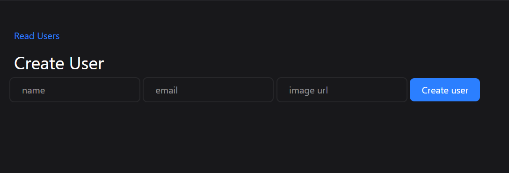
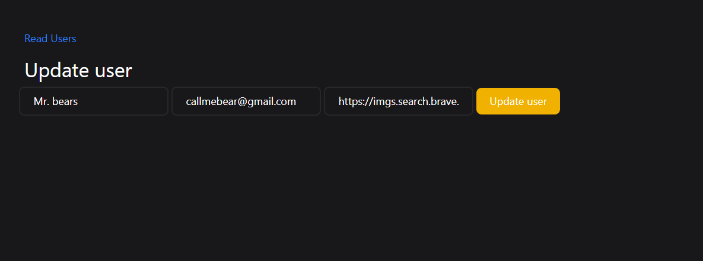

# Node.js CRUD Application

A simple CRUD web application built using Node.js, Express, EJS, and MongoDB.

## 🚀 Features
- Create, Read, Update, Delete users
- Server-side rendering using EJS
- MongoDB database with Mongoose
- Clean and simple UI

## 🛠 Tech Stack
- Node.js
- Express.js
- EJS
- MongoDB
- Mongoose
- Tailwind CSS

## 📸 Screenshots




## ⚙️ Installation & Run
1. Clone the repository
   ```bash
   git clone https://github.com/your-username/nodejs-ejs-mongodb-crud.git

