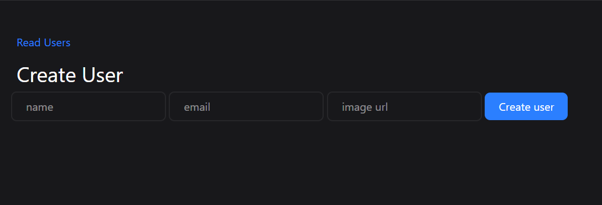
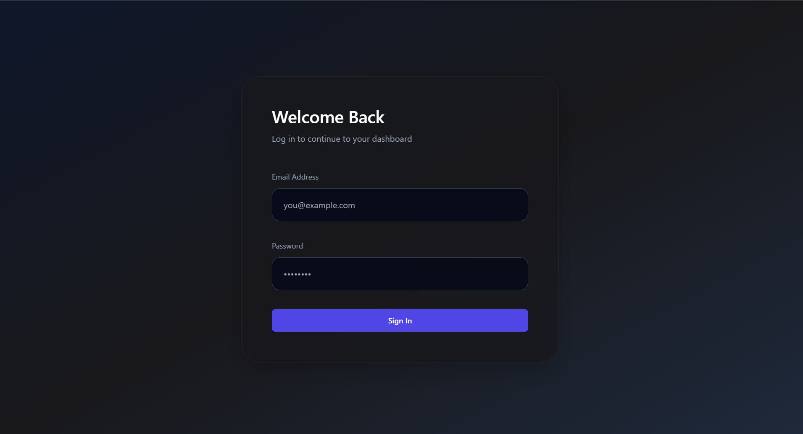
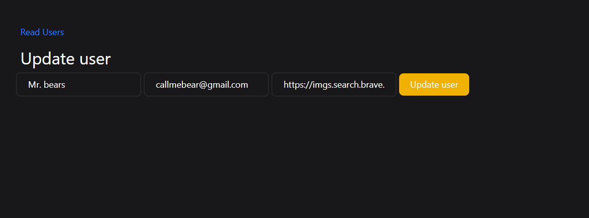

# Node.js Authentication & CRUD Application

A full-stack web application built using Node.js, Express, EJS, and MongoDB that supports user authentication (Signup/Login) with JWT and secure password hashing, along with complete CRUD functionality.

## 🚀 Features
- User Signup & Login
- Password hashing using bcrypt
- JWT-based authentication
- Create, Read, Update, Delete (CRUD) operations
- Protected routes
- Server-side rendering with EJS
- MongoDB database with Mongoose
- Clean and simple UI

## 🛠 Tech Stack
- Node.js
- Express.js
- EJS
- MongoDB
- Mongoose
- bcrypt
- JSON Web Token (JWT)
- Tailwind CSS

## 📸 Screenshots
  
  
  
  


## ⚙️ Installation & Run

1. Clone the repository
```bash
git clone https://github.com/newa060/nodejs-mongodb-crud
